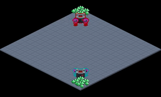

# RTS Self-Play

An example of using Griddly + RLLib to perform experiments with RTS-style environments.

### Join the Discord Community! [https://discord.gg/xuR8Dsv](https://discord.gg/xuR8Dsv)

# Griddly RTS

Full documentation for the Griddly RTS Environment can be found [here](https://griddly.readthedocs.io/en/latest/games/GriddlyRTS/index.html)

# RTS Environments with Griddly

Full documentation for using RTS environments with Griddly can be found [here](https://griddly.readthedocs.io/en/latest/rllib/rts/index.html)